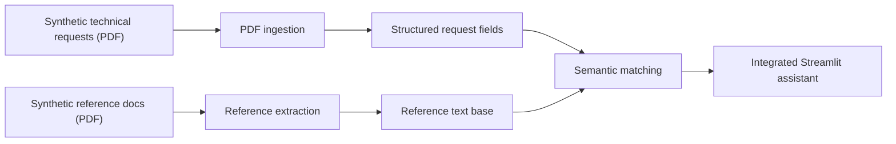

# Technical Request Document Assistant

## PT-BR

Projeto em Python para reproduzir, de forma pública e segura, um fluxo integrado de leitura de solicitações técnicas, extração estruturada de informações e recuperação de documentos de referência.

### Objetivo

Simular um ambiente em que usuários consigam:

- consultar solicitações técnicas em um único front;
- extrair campos importantes de PDFs automaticamente;
- localizar documentos de referência relacionados;
- responder dúvidas operacionais a partir do conteúdo documental.

### O que foi reproduzido

Esta versão pública reproduz o padrão técnico de uma solução corporativa sem usar nomes, documentos ou dados sensíveis. Em vez disso, ela usa:

- solicitações técnicas sintéticas em PDF;
- documentos de referência sintéticos;
- extração estruturada com regras;
- matching semântico com `TF-IDF`.

### Arquitetura



### Técnicas usadas

- geração de PDFs sintéticos com `reportlab`
- leitura de PDFs com `pypdf`
- extração de campos com `regex`
- matching entre solicitações e referências com `TF-IDF + cosine similarity`
- consulta guiada em `Streamlit`

### Bibliotecas e frameworks

- `reportlab`
- `pypdf`
- `pandas`
- `scikit-learn`
- `streamlit`

### Estrutura

- [main.py](/Users/flaviagaia/Documents/CV_FLAVIA_CODEX/technical-request-document-assistant/main.py)
- [app.py](/Users/flaviagaia/Documents/CV_FLAVIA_CODEX/technical-request-document-assistant/app.py)
- [src/generate_documents.py](/Users/flaviagaia/Documents/CV_FLAVIA_CODEX/technical-request-document-assistant/src/generate_documents.py)
- [src/extraction.py](/Users/flaviagaia/Documents/CV_FLAVIA_CODEX/technical-request-document-assistant/src/extraction.py)
- [src/retrieval.py](/Users/flaviagaia/Documents/CV_FLAVIA_CODEX/technical-request-document-assistant/src/retrieval.py)

### Como executar

```bash
python3 -m venv .venv
source .venv/bin/activate
pip install -r requirements.txt
python3 main.py
streamlit run app.py
```

---

## EN

Python project designed to publicly and safely reproduce an integrated workflow for technical request ingestion, structured extraction, and reference document retrieval.

### Goal

The application allows users to:

- browse technical requests in a single front-end;
- extract important fields from PDFs automatically;
- retrieve related reference documents;
- answer operational questions from document content.

### What was reproduced

This public version mirrors the technical pattern of an enterprise solution without using any original names or sensitive content. Instead, it uses:

- synthetic technical request PDFs;
- synthetic reference PDFs;
- rule-based structured extraction;
- semantic matching with `TF-IDF`.

### Architecture


